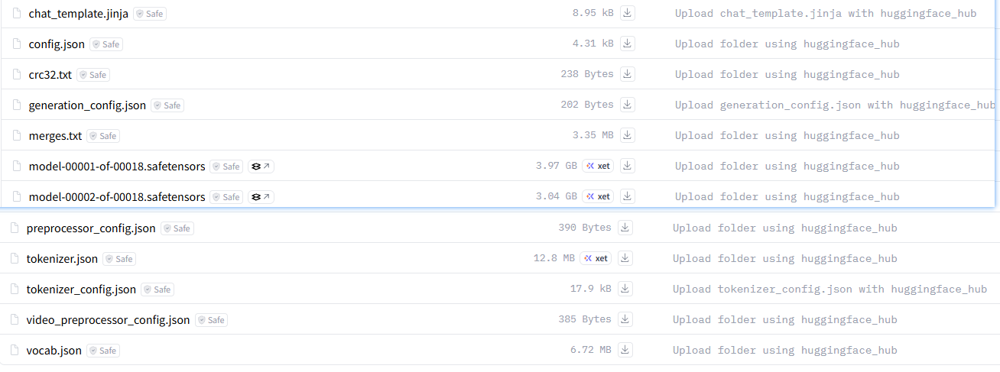

# 词嵌入与模型文件学习笔记

本章：Token ID 如何查表得到向量，以及模型文件、聊天模板的分工。

## Token Embedding：从编号到向量（2026-09-14）

### 我的原始理解与确认

- 用户：“经过了前面的分词器，token id映射，现在就到了 向量化了是吧？”
- 用户：“所以还是查表？这边就是一个 id 对应一个 浮点数数组？”随后确认“ok 记下来吧”。
- 🟢 概念判断正确：Token 是分词单位，Token ID 是词表中的整数编号，Embedding Vector（嵌入向量）是模型输入层按 ID 查表得到的固定长度数值数组。
- 在同一份模型权重下，仅看输入 Token Embedding 查表，相同 ID 得到相同向量。后续经过上下文处理的表示不受此结论约束。
- 教学示例：假设“猫”的 ID 为 2，表中编号 2 的一行为 `[0.7, -0.2, 0.5]`，则 ID 2 直接取出该行；不是把数字 2 乘入向量。这里的 ID 和向量均为手写假设，不是真实模型结果。

### 新问题：表在哪里，怎样训练出来？

用户：“又多了个表？这个表在哪呢？这个也是训练出来的表么？咋训练出来的？”

以下是本轮讲解，尚待用户复述确认；没有运行实验或检查具体模型文件。

| 对象 | 保存内容 | 所属部分 |
| --- | --- | --- |
| Tokenizer 词表 | Token 与整数 ID 的对应关系 | 分词器资产 |
| 输入 Embedding 权重表 | 每个 ID 对应的向量数值 | 神经网络模型权重 |

- Embedding 权重表是模型内部的二维参数数组（矩阵），通常随其他模型权重一起保存在 Checkpoint（模型检查点/权重文件）中，不一定独占一个文件。运行时加载到 CPU 内存或 GPU 显存，具体取决于部署方式。
- 表的形状是 `[vocab_size, hidden_size]`：`vocab_size` 是词表大小，对应行数；`hidden_size` 是这里每个向量的维度，对应列数。常见架构也用 `d_model` 表示模型隐藏维度；此处讨论输入嵌入维度与隐藏维度相同的常见情形。5 个 Token、每个向量 3 维，就是 5 行 3 列、共 15 个参数。
- 从零训练语言模型时，这张表通常随机初始化，然后随模型一起学习。训练文本先变成固定的 Token ID；模型查表并经过后续网络预测下一个 Token；Loss（损失，预测与正确目标之间的差距）用于计算梯度；Backpropagation（反向传播）把误差信号传回各层；Optimizer（优化器）按梯度更新包括 Embedding 在内的可训练权重。反复使用大量样本后，表内数字逐渐变成有助于预测的表示。
- 例如假设训练文本切为“我 / 喜欢 / 猫”：用“我 / 喜欢”预测下一个 Token“猫”。若给“猫”的概率太低，训练会更新参与预测的可训练参数，包括输入嵌入参数；并不是人工提供一个“猫的正确三维向量”让模型背下来。
- 在词表固定的前提下，训练更新的是向量数值，不是重新排列 Token ID。ID 数值大小或相邻关系本身不表示语义距离。
- 本节是 LLM 输入端的 Token Embedding；语义检索用的 Embedding 模型通常把整段文本处理成检索向量，不能将二者当作同一个输出。

### 本节验证状态

- 已确认：用户理解“ID 查表得到浮点数数组”。
- 待确认：表的存储位置、形状、训练流程。
- 待执行：手算输入 `[2, 4, 2]` 的查表结果，再用代码验证。没有下载模型、训练模型或运行 Embedding Demo。

## 从真实模型仓库看文件与分工（2026-09-14）

用户观察：“里面有很多关键的文件”；“不同模型转换的规矩不同，应用层一般只管传递统一规范的 message JSON”。🟢 已理解配套关系；补充边界：模板转换在神经网络外部执行。



截图来源：[Qwen/Qwen3.8-27B 模型仓库](https://huggingface.co/Qwen/Qwen3.8-27B/tree/main)。

| 文件 | 作用 |
| --- | --- |
| `chat_template.jinja` | 聊天模板：把角色消息组织成模型训练时约定的输入格式 |
| `vocab.json`、`merges.txt` | Token 与 ID 对照表、BPE 合并规则 |
| `tokenizer.json`、`tokenizer_config.json` | 分词器数据与配置；可能与单独词表、合并规则文件包含重叠信息 |
| `config.json` | 模型结构配置，如隐藏维度 |
| `model-*.safetensors` | 模型权重分片，包含 Embedding 和其他层的参数 |
| `model.safetensors.index.json` | 参数存放在哪个权重分片的索引 |
| `generation_config.json` | 默认生成参数 |
| `preprocessor_config.json`、`video_preprocessor_config.json` | 图像、视频预处理配置 |

本轮已查看[权重索引](https://huggingface.co/Qwen/Qwen3.8-27B/raw/main/model.safetensors.index.json)：输入向量表 `model.language_model.embed_tokens.weight` 存在第 3 个权重分片。根据[文本模型配置](https://huggingface.co/Qwen/Qwen3.8-27B/raw/main/config.json)，其表形状应为 `[248320, 5120]`，即每个 ID 查出 5120 个数；未下载大权重验证。

**模型目录不等于单个权重文件。** 这些资产可以分开存储和使用，但 Token 含义、ID 编号、Embedding 行号必须配套。前面的分词实验只加载 Tokenizer，也能独立运行。

### Chat Template 由谁处理？

不同模型可能采用不同聊天格式，也可能共用格式。规则由模型训练约定决定，转换通常由推理服务或分词器配套工具执行，不属于神经网络内部计算。

```text
应用组织 messages（角色、内容、历史）
  → 服务端套用 Chat Template
  → Tokenizer 转成 Token ID
  → 模型内部：Embedding 查表 → 后续计算
```

- 调用接收 `messages` 的聊天服务：应用通常传消息即可，由服务端套模板；消息字段仍需符合服务接口。
- 本地直接加载模型，或接口只接收原始文本：调用方需要负责准备正确格式的输入。

