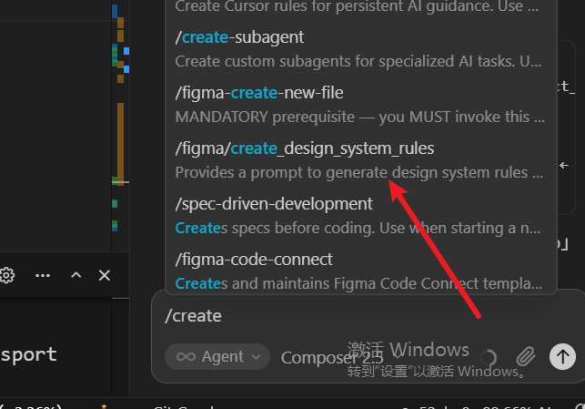
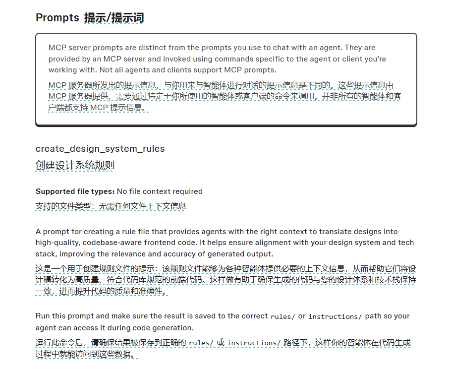

# s19：MCP Tools — 外接工具，标准协议

## 本章定位

本章把前面“工具由 Agent 工程师手写并注册”的模型，扩展成“Host 可以通过标准协议接入外部能力”的模型。

MCP 是 Model Context Protocol（模型上下文协议）。它规定 Host 与能力提供方之间如何协商、发现和调用能力。它本身不是模型，也不是业务 API；模型通常仍然通过 Host 的 Tool Calling 提出动作，Host 再通过 MCP Client 把动作转成 MCP 请求。

本章教学代码是一个可运行的 mock（模拟）实现，重点是观察：

1. 外部工具如何被发现；
2. 发现结果如何加入 Agent 的工具池；
3. 模型如何调用带命名空间的 MCP 工具；
4. 工具池变化后，为什么需要重新组装工具和 prompt。

真实 MCP Server、真实传输、JSON-RPC 报文和生产级治理暂缓到 [W-2026-028](../specs/work-pool/W-2026-028-build-useful-mcp-server.md)。

## 一、术语和角色

| 术语 | 中文含义 | 所在层次 | 本章中的职责 |
| --- | --- | --- | --- |
| Host | 宿主应用 | Agent Runtime / Harness | 持有模型、上下文、工具池和权限决策 |
| MCP Client | MCP 协议客户端 | Host 内部 | 连接 MCP Server、发现能力、发送调用请求 |
| MCP Server | MCP 能力提供方 | 外部进程或远程服务 | 声明并执行 Tools、Resources、Prompts |
| Model | 模型 | LLM 层 | 根据可见工具定义决定是否提出 Tool Calling |
| Transport | 传输方式 | 通信层 | 搬运 MCP 消息，例如 stdio 或 Streamable HTTP |
| JSON-RPC | 请求/响应消息格式 | 协议消息层 | 表达 method、params、id、result 或 error |
| 下游业务系统 | Jira、Figma、部署平台等 | 业务系统层 | MCP Server 最终调用或操作的真实系统 |

最重要的边界是：

~~~text
模型 Tool Calling：
    模型 -> Host

MCP：
    Host 内的 MCP Client -> MCP Server -> 下游业务系统
~~~

Tool Calling 不限定工具实现是在本地函数、远程 HTTP API 还是 MCP Server 中。MCP 提供的是 Host 与能力提供方之间的一套可互操作契约。

MCP Server 也不一定在远程机器上。它可以是本地子进程，也可以是远程 HTTP 服务；“是不是 MCP”不能用“是否远程”判断。

## 二、我的原始理解与校准

### 1. “MCP Server 可能就是一个带 register、call_tool 方法的对象”

🟡 **部分正确。**

这正是本章教学版的设计：用一个 Python 对象把注册、发现和调用压缩在一起，便于先理解工具池变化。

真实实现中，这个对象通常是 MCP Client 的 SDK 封装。它要处理 Transport、JSON-RPC、initialize、能力协商、tools/list、tools/call、错误、生命周期等边界，不是 Server 本身的全部内容。

### 2. “HTTP MCP Client 可以请求 /exec，body 传 name 和 arguments”

🟡 **作为自定义 RPC 方案可以工作，但不是 MCP 标准。**

真实 MCP 通常是在同一个传输入口上发送 JSON-RPC method，例如：

~~~text
initialize
notifications/initialized
tools/list
tools/call
~~~

所以“一个 HTTP 入口 + method 区分操作”的直觉是对的；需要校准的是 method、params、id、result 和 error 的具体结构由 MCP/JSON-RPC 约定，而不是自行设计 /exec。

### 3. “npx 就是 stdio 协议”

🔴 **需要纠正。**

npx 只是 Node.js 包的启动器。配置中的 command 和 args 让 Host 启动一个子进程；Host 与该进程通过 stdin/stdout 通信时，Transport 才是 stdio。

~~~text
command: npx
args: [...]
        -> 启动程序
stdio
        -> Host 与程序之间的通信方式
MCP
        -> 双方交换的应用层协议
~~~

### 4. “initialize 可能是为了复用长连接”

🟡 **部分正确。**

initialize 的核心职责是协议版本协商、客户端信息、服务端信息和能力声明。它与 HTTP keep-alive、SSE 流、MCP logical session 是不同层次：

1. HTTP keep-alive 是连接复用；
2. SSE 是一种 HTTP 响应传输形式；
3. MCP session 是否保存服务端状态，取决于具体实现。

stdio 通常可以复用同一对子进程管道。HTTP 可以复用底层连接，也可以每次独立请求；不能仅凭 HTTP 就推断 MCP 一定是长连接有状态会话。

### 5. “模型在连接前完全不知道 MCP Server，会不会向所有 MCP 发 initialize”

🟡 **需要拆开两件事。**

模型通常不知道所有可用 Server。可用 Server 的地址、启动命令、凭据和名称一般由 Host 配置、用户设置或连接器提供。Host 可以在启动时连接，也可以按需连接。

模型能不能提出连接请求，取决于 Host 暴露了什么入口。例如本章把 connect_mcp 作为内置 Tool，并在 description 中写了 docs、deploy；模型并不是从 MCP 协议自动发现了这两个名字。

连接一个 Server 后，MCP Client 才向该 Server 发送 initialize，再按能力和需求发送 tools/list、prompts/list 或 resources/list。没有必要向模型未知的所有 Server 广播 initialize。

### 6. “MCP 会自动减少模型上下文”

🔴 **需要纠正。**

把工具放到 MCP Server 不会自动减少模型看到的 Tool Schema、description 或结果。MCP 解决统一接入和发现契约；按需发现、工具筛选、分页、截断、缓存、结果引用和 token 预算仍然要由 Host 设计。

### 7. “Tools、Resources、Prompts 是 MCP 的三种能力”

🟢 **已确认，术语需要说成三类能力或三种 primitive，而不是三个 method。**

典型方法是：

~~~text
Tools：
    tools/list
    tools/call

Resources：
    resources/list
    resources/read

Prompts：
    prompts/list
    prompts/get
~~~

## 三、MCP 的三类能力

### Tools：模型可提出的动作或计算

Tools 通常是 model-controlled（模型主导）：模型看到 Tool definition 后提出名称和参数，Host 决定是否执行，再把结果放回模型上下文。

Tool definition 通常包含：

- name
- title 或 description
- inputSchema
- 可选 annotations 或其他元数据

Tool 可以读取数据、执行计算，也可以修改外部状态。返回值可以是文本、结构化 JSON、图片、Base64 或资源链接；返回值格式不能单独决定它是不是 Tool。

### Resources：应用可读取的外部数据

Resources 通常是 application-controlled（应用主导）：Server 暴露可寻址的数据，Host 或客户端决定什么时候读取、是否展示或是否放入模型上下文。

Resource 更像：

~~~text
figma://file/123/node/456/css
figma://project/123/design-system/tokens.json
file:///workspace/README.md
~~~

它可以返回文本，也可以返回二进制 blob。关键不是“内容是什么格式”，而是它被建模成一个可读取的数据资源。

### Prompts：用户选择的提示模板或工作流

Prompts 通常是 user-controlled（用户主导）：Server 提供一个可复用的提示模板，客户端把它显示为命令、快捷操作或斜杠命令，用户明确选择后，客户端调用 prompts/get 获取填充参数后的消息。

Prompt 不是普通聊天框里的任意一句 prompt，也不是模型自动调用的 Tool。它可以返回一组 user/assistant messages，也可以在消息中嵌入 Resource。

已经核验过的实际例子：

- MCP 官方 Everything 参考服务器用于展示 prompts、resources、tools；
- Figma MCP Server 提供 create_design_system_rules Prompt，用于生成帮助 Agent 理解设计系统和技术栈的规则文件；
- Figma Make 集成使用 Resources，让 Agent 获取项目文件和项目上下文；
- Figma 的 download_assets 是 Tool，用于执行资源导出，即使结果是文件 URL，也没有因此变成 Resource。

参考：

- [MCP Prompts 规范](https://modelcontextprotocol.io/specification/2025-06-18/server/prompts)
- [MCP 官方示例服务器](https://modelcontextprotocol.io/examples)
- [Figma Tools and Prompts](https://developers.figma.com/docs/figma-mcp-server/tools-and-prompts/)
- [Figma Resources](https://developers.figma.com/docs/figma-mcp-server/bringing-make-context-to-your-agent/)

### Figma Prompt 能力的实测证据

本次在客户端命令面板中实际看到了 Figma Prompt 的入口：

命令显示为 **/figma-create_design_system_rules**，底层对应的 Prompt 名称是 **create_design_system_rules**。这证明 Prompt 可以被 MCP Server 提供，再由客户端映射成用户可以选择的命令或快捷入口。

Figma 文档对这个 Prompt 的说明如下：

文档说明了三件事：

1. MCP Server 提供的 Prompt 与用户平时在聊天框中输入的 Prompt 不是同一个概念；
2. **create_design_system_rules** 用于生成帮助 Agent 理解设计系统和技术栈的规则文件；
3. 结果应保存到客户端能够读取的 **rules/** 或 **instructions/** 路径。

证据边界：

- 🟢 已验证：Figma Prompt 已经出现在实际客户端的命令列表中，且客户端提供了对应的用户触发入口；
- 🟢 已验证：Figma 官方文档明确把 **create_design_system_rules** 标为 MCP Server Prompt；
- 🟡 尚未验证：本次没有抓取 Figma Server 的原始 **prompts/list** 和 **prompts/get** JSON-RPC 报文，因此还不能把客户端命令显示等同于已经观察到完整的协议层请求。

## 四、用 Figma 判断三类能力

| 用户意图 | 更适合的能力 | 判断理由 |
| --- | --- | --- |
| 在画布中创建 Frame 或 Rectangle | Tool | 修改 Figma 状态，需要执行动作 |
| 读取节点当前的 CSS 表示 | Resource | 如果它被暴露为稳定、可寻址的 CSS 数据 |
| 根据节点实时计算并生成 CSS | Tool | 这是一次动态计算或转换 |
| 导出 PNG、SVG、PDF | Tool | 这是执行导出操作 |
| 获取 Make 项目中的文件和上下文 | Resource | 读取外部项目数据 |
| 生成设计系统规则文件 | Prompt | 用户选择一个预定义工作流 |

因此，“导出 CSS 是 Resource”有条件地成立：

~~~text
读取一个已经存在的 CSS 表示
    -> Resource

现在根据节点计算并生成 CSS
    -> Tool
~~~

Tool 也可以返回 CSS 文本；Resource 也可以返回 Base64。应根据“是否执行动作、谁控制、数据是否有稳定地址、是否是现成表示”来判断。

## 五、本章教学代码的真实映射

### MCPClient：把真实通信压缩成对象状态

代码位置：[code.py](./code.py:811)

~~~python
class MCPClient:
    def __init__(self, name: str):
        self.name = name
        self.tools = []
        self._handlers = {}

    def register(self, tool_defs, handlers):
        self.tools = tool_defs
        self._handlers = handlers

    def call_tool(self, tool_name, args):
        handler = self._handlers.get(tool_name)
        return handler(**args)
~~~

在教学模型中：

| 教学代码 | 真实 MCP 中更接近的含义 |
| --- | --- |
| register | 模拟 Server 已完成 Tool 注册，或 Client 缓存 tools/list 结果 |
| client.tools | Client 从 tools/list 得到的 Tool definitions |
| call_tool | 模拟 tools/call |
| _handlers | 本地直接执行的函数，隐藏了真实 Server |

它没有真的启动子进程，没有发送 stdin/stdout，没有发送 JSON-RPC，也没有处理 initialize、认证、断连和超时。

### MOCK_SERVERS：本地工厂，不是网络连接

代码位置：[code.py](./code.py:854)

docs 和 deploy 是两个本地工厂函数。工厂创建 MCPClient，再通过 register 填充 Tool definitions 和 Python handlers。

~~~text
MOCK_SERVERS["docs"]
    -> _mock_server_docs()
    -> MCPClient("docs")
    -> register(search, get_version)
~~~

真实环境中，类似的配置可能是：

~~~text
Server name
    + command/args，启动本地子进程
    或
    + url/headers，连接远程 HTTP Server
    + credentials、timeout、allowed capabilities 等配置
~~~

### connect_mcp：教学版的连接和发现入口

代码位置：[code.py](./code.py:922)

connect_mcp 做了四件事：

1. 检查 Server 是否已经连接；
2. 用 name 在 MOCK_SERVERS 中查找工厂；
3. 创建并保存 MCPClient；
4. 返回已发现的 Tool 名称。

它不是 MCP 标准方法名，也没有真的完成网络连接。它是本章 Host 自己暴露的一个内置 Tool，用于让模型按需触发连接。

### normalize_mcp_name：命名安全和命名空间准备

代码位置：[code.py](./code.py:838)

所有不在 [a-zA-Z0-9_-] 范围内的字符被替换为下划线。

作用是让 Server 名和 Tool 名可以安全地进入 Host 的工具命名空间，并降低特殊字符造成的冲突或解析问题。它不是完整的安全边界，也不能代替权限校验。

### assemble_tool_pool：把多个来源组装成模型可见工具

代码位置：[code.py](./code.py:946)

组装过程：

~~~text
BUILTIN_TOOLS
    + 每个已连接 MCP Client 的 tools
    -> normalize server/tool name
    -> mcp__{server}__{tool}
    -> 追加到同一个 tools 列表
    -> 建立对应 handler 映射
~~~

例如：

~~~text
Server 原始名：docs
Tool 原始名：search
Host 暴露名：mcp__docs__search
~~~

这个前缀是 Host 的本地命名空间，不是 MCP Server 返回的原始 Tool 名。它避免 docs.search 和 deploy.search 发生冲突。

教学版把 MCP 的 inputSchema 映射到模型 SDK 需要的 input_schema；Tool description 中用 readOnly 或 destructive 文本标注意图。真实系统通常还有结构化 annotations 和独立权限系统，但教学版没有实现真正的权限拦截。

### agent_loop：工具池动态变化

代码位置：[code.py](./code.py:1259)

核心流程：

~~~text
进入 agent_loop
    -> assemble_tool_pool()
    -> assemble_system_prompt()
    -> 把 tools 和 system 交给模型

模型提出 connect_mcp("docs")
    -> Host 执行内置 handler
    -> docs Client 被创建
    -> tool_result 返回模型
    -> 重新 assemble_tool_pool()
    -> 重新 assemble_system_prompt()
    -> 下一轮模型看到 mcp__docs__search 等新工具

模型提出 mcp__docs__search(...)
    -> handlers 找到包装函数
    -> MCPClient.call_tool("search", args)
    -> 本地 mock handler 执行
    -> tool_result 返回模型
~~~

重新组装是关键：connect_mcp 执行前，模型的 tools 列表里没有 docs 工具；连接之后旧的工具列表已经过时。教学版因此取消了之前的 prompt cache，并在连接后显式重建工具和 system prompt。

system prompt 中固定写了 connect_mcp 和命名规则；已连接的 Server 名称还会动态追加到 system prompt。这个 Server 名称来源于 Host 的配置和教学字典，不是模型通过 MCP 协议自行发现的全局目录。

### Lead 与 Teammate 的边界

本章 assemble_tool_pool 只服务 Lead 的 agent_loop。Teammate 继续使用固定的 8 个子集工具，代码没有把 MCP 工具注入 Teammate。

这是教学实现边界。README 对真实产品行为有进一步描述，但当前学习只把它作为待核验的版本相关信息，不能把它当成通用 MCP 保证。

## 六、真实 Context7 HTTP 实测

完整原始报文保存在 [MCP_RESPONSES.md](./MCP_RESPONSES.md)。本节只保留调用链和关键结论。

实测时间：2026-09-11。

Endpoint：https://mcp.context7.com/mcp

本次请求使用 POST、JSON-RPC 和 Accept: application/json, text/event-stream；返回 Content-Type 是 text/event-stream。本次没有携带 API Key，也没有观察到 Mcp-Session-Id header。

### initialize

请求包含：

~~~json
{
  "jsonrpc": "2.0",
  "id": 1,
  "method": "initialize",
  "params": {
    "protocolVersion": "2025-11-25",
    "capabilities": {},
    "clientInfo": {
      "name": "learn-claude-code-inspector",
      "version": "0.1.0"
    }
  }
}
~~~

响应观察到：

- 最终协议版本是 2025-11-25；
- serverInfo 是 Context7 4.1.0；
- capabilities 声明 prompts、resources、tools 的 listChanged；
- instructions 告诉 Client：当用户询问库、框架、SDK、API、CLI 或云服务文档时使用该 Server。

instructions 是 Server 返回的使用说明，不是 Host 的安全策略，也不是权限授予。

### notifications/initialized

initialize 成功后发送没有 id 的通知，HTTP status 是 202、body 为空。没有 id 意味着它是 JSON-RPC notification，客户端不等待 result。

### tools/list

返回了两个 Tool：

1. resolve-library-id
2. query-docs

响应中包含 name、title、description、inputSchema 和 annotations。description 还表达了调用顺序：通常先 resolve-library-id，再 query-docs。

这验证了 Agent/Host 的工具发现过程：先拿 Tool definition，再把它转换为模型可以理解的工具列表。

### tools/call

调用 resolve-library-id：

~~~json
{
  "jsonrpc": "2.0",
  "id": 3,
  "method": "tools/call",
  "params": {
    "name": "resolve-library-id",
    "arguments": {
      "query": "MCP",
      "libraryName": "Model Context Protocol"
    }
  }
}
~~~

返回一个 content 数组，其中本次内容块是 text，列出多个 Model Context Protocol 相关库。完整候选列表见 MCP_RESPONSES.md。

### 本次实测能证明什么

🟢 已直接观察：

- JSON-RPC method 和 id；
- initialize、notification、tools/list、tools/call；
- HTTP/SSE 形态；
- Server capabilities、serverInfo、instructions；
- Tool definition、inputSchema、annotations；
- Tool call 的 name、arguments 和 content result。

🟡 仍不能从本次观察断言：

- Context7 是否使用有状态 MCP session；
- 所有 MCP Server 都使用同样的 HTTP/SSE 行为；
- Context7 实际暴露哪些 Prompts 或 Resources，因为本次没有请求 prompts/list 或 resources/list；
- 任意 MCP Client 都会采用同样的 Host 命名空间和权限策略。

## 七、真实 MCP 的最小调用链（2025-11-25 / legacy lifecycle）

下面这条链是本次 Context7 实测和 2025-11-25 协议版本对应的 legacy lifecycle（旧版生命周期）：

~~~text
Host 读取 Server 配置
    -> 创建 MCP Client 和 Transport
    -> initialize
    <- protocolVersion + serverInfo + capabilities + instructions
    -> notifications/initialized
    -> tools/list
    <- Tool definitions + inputSchema
    -> Host 做权限、命名空间、筛选和上下文预算处理
    -> 将适合的 tools 交给模型
    -> 模型提出 Tool Calling
    -> MCP Client 发送 tools/call
    <- MCP Server 返回 result 或 error
    -> Host 把结果转换成下一轮模型上下文
~~~

### 协议版本边界

这条链不是所有未来 MCP 版本的永久固定流程。2026-07-28 版本的 MCP 已将核心协议改为无状态请求模型，移除了 initialize、notifications/initialized 和 Mcp-Session-Id；请求自身携带协议版本、客户端信息和能力元数据，需要能力发现时可以使用 server/discover。

因此，学习和实现真实 MCP 时必须先固定协议版本，再按该版本的 lifecycle 编写 Client、测试和部署说明。本章的 Context7 报文记录明确使用 2025-11-25，所以本节的 initialize 链对那次实测是准确的；它不能直接当作当前所有 MCP Server 的通用连接流程。

如果是 Resource：

~~~text
Host 或客户端决定读取
    -> resources/list / resources/read
    <- URI 对应的数据
    -> Host 决定是否放入上下文
~~~

如果是 Prompt：

~~~text
用户在客户端选择 Prompt
    -> prompts/list / prompts/get
    <- 参数填充后的 messages
    -> Host 把 messages 放进模型上下文
    -> 模型继续工作，必要时再调用 Tools
~~~

## 八、教学实现和生产实现的差距

本章代码成功展示了工具发现和调用分发，但没有提供生产保证。完整的生产验收矩阵保存在 [W-2026-028](../specs/work-pool/W-2026-028-build-useful-mcp-server.md)；这里保留最重要的边界：

### 协议和生命周期

- 真实实现需要处理协议版本、能力协商、分页、动态列表变化、断连、重连和关闭；
- stdio 需要处理子进程环境、stdout 协议污染、异常退出和清理；
- HTTP 需要考虑 TLS、Origin/Host 边界、超时、连接复用、会话状态和优雅停机；
- 不要把 SDK 的便捷封装当成 MCP 协议本身。

### 安全和授权

- Tool description、instructions、annotations 和结果都是外部元数据，不能直接当作权限系统；
- 发现阶段过滤不能代替执行阶段的对象级授权；
- 需要隔离 Server 身份、凭据、网络权限和 Tool 命名空间；
- 需要防范提示注入、工具投毒、路径穿越、命令注入、SSRF 和秘密泄露；
- 代码注释里曾出现 token-like 的凭据样式内容；如果是真实凭据，应立即轮换，凭据不应写入代码或学习笔记。本次 Context7 实测没有使用该值。

### 可靠性和副作用

- 超时不等于执行失败，尤其是写操作；
- 需要区分重试安全、幂等键、响应丢失后的查询和对账；
- 写入前应持久化意图，必要时记录补偿或恢复状态；
- 需要设置并发、速率、结果大小、队列和资源上限；
- 长任务需要可追踪状态，不能只依赖一个 HTTP 请求一直等待。

### 上下文和运维

- Tool schema、description 和大结果都会消耗上下文；
- 需要按需发现、筛选、分页、截断、结果引用和权限相关缓存键；
- 日志需要关联 Agent Run、Tool Call、MCP request 和下游操作；
- 需要契约、集成、客户端端到端、故障、安全、性能和效果评估；
- 部署、升级、禁用、回滚和恢复都要有可验证证据。

## 九、本章掌握状态

### 🟢 已掌握或已直接验证

- Tool Calling 与 MCP 的层次边界；
- Host、MCP Client、MCP Server、模型、Transport 的角色；
- 教学 Mock 中 register、call_tool、connect_mcp、assemble_tool_pool 的关系；
- Server/Tool 名称规范化和 mcp__server__tool 命名空间；
- connect_mcp 后为什么必须重建工具池和 system prompt；
- 本地 stdio、远程 HTTP、npx 启动器和 MCP 协议的区别；
- initialize 是协商和握手，不等于 TCP 长连接；
- 真实 Context7 的 initialize、notifications/initialized、tools/list、tools/call 报文形态；
- Tools、Resources、Prompts 是三类能力，而不是三个 method。

### 🟡 已建立概念，但尚未完成真实报文练习

- Resources 的 resources/list、resources/read 和 URI/blob 细节；
- Prompts 的 prompts/list、prompts/get 和 messages 细节；
- Prompt 嵌入 Resource 的完整客户端行为；
- 动态 listChanged 通知、分页和资源订阅；
- Figma 的实际 Tools/Resources/Prompts 组合。

### 🔴 尚未完成

- 选择一个真实业务场景；
- 使用一个确定语言和 SDK 实现 MCP Client/Server；
- 完成真实只读服务；
- 为生产目标完成认证、授权、可靠性、可观测性、测试、部署和回滚证据；
- 证明服务达到约定的生产 SLO 和安全门槛。

## 十、与 Work Pool 的关系

[W-2026-028：实现一个真实有用的 MCP 服务](../specs/work-pool/W-2026-028-build-useful-mcp-server.md) 当前状态是 ready，尚未启动。

它已经记录：

- 真实业务场景和客户端选择；
- 协议、SDK、Transport 和认证；
- Tools/Resources/Prompts 深入学习；
- 工具契约、权限、租户隔离、信任边界；
- 超时、取消、重试、幂等、并发和资源治理；
- 上下文预算、日志、Trace、审计、测试、发布、回滚和运维。

本章的学习目标已经达到：能够解释 s19 教学 Demo 的发现、组装、调用链，并能用真实 Context7 报文校准 MCP 的基本机制。

本章没有达到“已经实现生产级 MCP 服务”的目标；那是 W-2026-028 启动后的工作。

跨章节的 Agent 流程、状态机、数据流和面试表达方法，统一记录在
[Agent 流程与状态建模方法](../docs/agent-engineering/agent-flow-and-state-modeling.md)。
